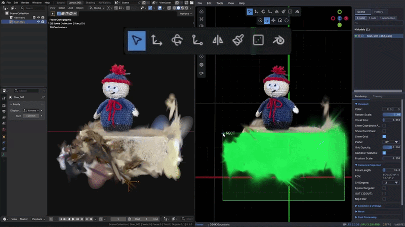

# GauSpla

<p align="center">
  
</p>

`GauSpla` is a Blender addon for viewing Gaussian splats from `.ply` files and keeping a Blender object linked to a file on disk for quick reload.

This repository contains two parts:

- the repository root is the `GauSpla Blender Sync` plugin for LichtFeld Studio
- `Blender_Addon/GauSpla` contains the Blender addon

## What It Does

### GauSpla (Blender addon)

- imports Gaussian splat `.ply` files into Blender
- keeps the same Blender object linked to the source file
- supports `Auto Sync` so the object reloads when the linked `.ply` changes on disk
- provides `Splats` and `Points` preview modes in the viewport

### GauSpla Blender Sync (LichtFeld Studio plugin)

- adds a one-click sync button in LichtFeld Studio
- exports selected linked splat nodes back into their own `.ply` files
- is intended for the workflow:

`Edit in LichtFeld Studio -> Quick Sync -> Blender reloads the same linked object`

## Installation

### LichtFeld Studio plugin

#### Installation (LichtFeld Studio v0.5+)

In LichtFeld Studio:

1. Open the `Plugins` panel
2. Enter:

```text
https://github.com/OlstFlow/GauSpla
```

3. Install the plugin
4. Restart LichtFeld Studio if needed

### Blender addon

1. Zip the folder `Blender_Addon/GauSpla`
2. In Blender, open:
   `Edit -> Preferences -> Add-ons -> Install...`
3. Select the zip
4. Enable `GauSpla`

You can also install it by dragging the zip into the Blender viewport if your Blender build supports that flow.

Prebuilt downloads:

- [GauSpla Releases](https://github.com/OlstFlow/GauSpla/releases)

## Recommended Workflow

1. In Blender, use `Import Linked PLY`
2. Enable `Auto Sync`
3. Open and edit the same `.ply` in LichtFeld Studio
4. Click the sync button in LichtFeld Studio
5. Blender reloads the same linked object

## Warning

⚠️ The LichtFeld Studio sync plugin overwrites the linked `.ply` file in place.

If you do not want to lose the original file, work on a copy or keep a backup.

## Compatibility Note

The repository-root plugin was built for the LichtFeld Studio plugin API used by `v0.5.x`.

Best-tested path:

- `LichtFeld Studio v0.5.0`

Some stock `v0.5.1` builds may require an upstream toolbar/plugin API patch for exact one-click toolbar behavior.

## License

The Blender addon code in this bundle is released under `GPL-3.0-or-later`.

See:

- `Blender_Addon/GauSpla/LICENSE`
- `Blender_Addon/GauSpla/THIRD_PARTY_NOTICES.md`

## Notes

If you only need fast `.ply` overwrite inside LichtFeld Studio without the Blender-oriented workflow, use the separate generic plugin:

- [Lichtfeld-PLY-Quick_Sync-Plugin](https://github.com/OlstFlow/Lichtfeld-PLY-Quick_Sync-Plugin)
